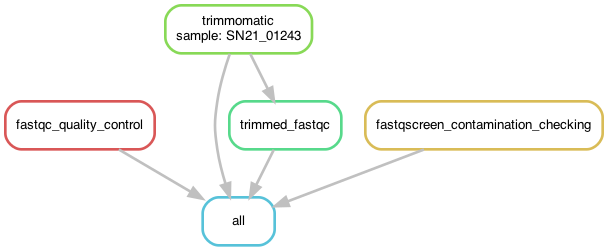
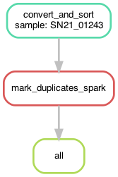
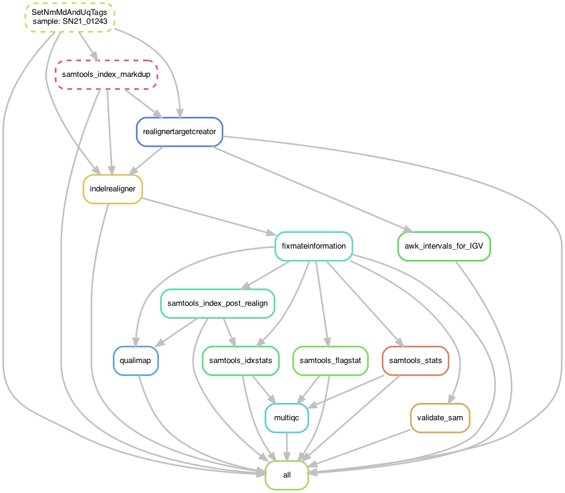
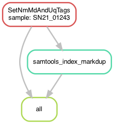
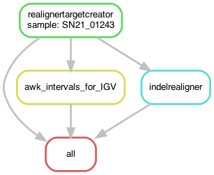
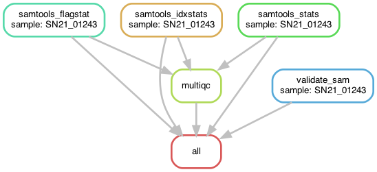

# SHAVE: SHort-read Alignment pipeline for VEctor v.1 - with UnifiedGenotyper variant calling - for IFB-core cluster #


 | Catalina (10.15.7) | Big Sure (11.6.3) | Monterey (12.2.0)/E6055C?icon=apple&label&list=|&scale=0.9>)
 | Focal Fossa (20.04) | Jammy Jellyfish (22.04)/772953?icon=https://www.svgrepo.com/show/25424/ubuntu-logo.svg&label&list=|&scale=0.9>)


## ~ ABOUT ~ ##

SHAVE is a bioinformatic pipeline used for mosquitoes (*Aedes / Anopheles*) genome alignments from Illumina short reads, based on GATK Best Practices (except for the BQSR and VQSR steps - see below). 

In brief, SHAVE remove adatpers, report quality reads, aligns reads to a reference genome, fix incorrect mates, mark duplicates, perform a realignment around indels into BAM files, validate BAM files according to SAM/BAM specifications. 

Unlike SHAVE2, which uses HaplotypeCaller to call variants and genotype likelihoods, SHAVE has been created to respect the parameters of the MalariaGEN pipelines, in order to be able to call variants and genotypes under the same conditions the MalariaGEN may have used. That's why SHAVE uses the old GATK's version with RealignerTargetCreator, IndelRealigner and UnifiedGenotyper to call variants and Genotypes as made by the MalariaGEN. 

If you want to use a more modern way of calling variants, use [**SHAVE2**](https://github.com/ltalignani/SHAVE2). 

If you want to compare your results to those obtained by MalariaGEN, you are in the right place: this pipeline is made for you.

This pipeline takes into account the "reality on the ground". 
If you want to run the pipeline in one command, use the "**Start_shave_slurm.sh**" script.
It is possible to launch only the trimming of reads with the script "**Start_trimming.sh**", or the mapping with the script "**Start_mapping.sh**". 
If you already have bam files, it is possible to mark duplicates with the script "**Start_markdup.sh**". The polishing of bam mark duplicates files can be done in one step using the "**Start_polishing.sh**" script or in four steps if your cluster is temperamental. 
Finally, you can launch only the SNP calling on finalized bam files with the script "**Start_unifiedgenotyper.sh**". 


**Note about BQSR and VQSR :**

***Base Quality Score Recalibration*** step needs as input a *known variation* VCF file, refering to the Ensembl-Variation database or dbSNP database who stores areas of genome that differ between individual genomes ("variants"). However, we do not have any prior list of know variants for our *Aedes* species, that's why we cannot do BQSR. 

The value of BQSR is also [increasingly being questioned](https://bmcbioinformatics.biomedcentral.com/articles/10.1186/s12859-016-1279-z#Abs1) as mappers and callers are typically updated. Using HaplotypeCaller instead of UnifiedGenotyper greatly improves the handling of indels.

***Variant Quality Score recalibration*** is probably the hardest part of the Best Practices to get right [according to Broad Institute](https://gatk.broadinstitute.org/hc/en-us/articles/4413056319131-VariantRecalibrator). In a nutshell, it is a sophisticated filtering technique applied on the variant callset that uses machine learning to model the technical profile of variants in a training set and uses that to filter out probable artifacts from the callset.

The key point is that it use known, highly validated variant resources (omni, 1000 Genomes, hapmap) to select a subset of variants within our callset that we’re really confident are probably true positives (that’s the training set). Unfortunately, no highly validated variant resource is available for *Aedes* at this time, so we decided to apply hard-filtering and leave the choice of parameters to the user. An extraction of some informations of the raw VCF is done by SHAVE, to help choosing the right parameters.

Written for **MOVE-ADAPT** project. 


### Features ###
**SHAVE pipeline:** 

- Control reads quality (__fastQC__, __fastq-screen__ and __multiQC html report__) and clean it,  
- Align reads (_sam files_),
- Convert sam into bam format and sort by coordinates,
- Add MD / NM and UQ tags to BAM files,
- Mark duplicates to BAM files,
- Validate BAM file according to SAM/BAM specifications,
- Perform a Qualimap report on bam files,
- Creates an Indels interval list,
- View intervals in IGV,
- realign Indels,
- Fill-in mate coordinates,
- Fix mates information,
- Index realigned bam,
- Stats on bam,
- Variant calling on each sample (_vcf files_),
- Genotyping, 
- VCF compression,
- Combine sample VCFs into one,
- Variant filtering,

### Version ###
*V2.2023.01.25*  

### Directed Acyclic Graphs ###

#### Trimming


#### Mark duplicates


#### Polishing


#### Polish_1


#### Polish_2


#### Polish_3


#### Polish_4


## ~ INSTALLATIONS ~ ##

# Conda _(required)_ #
Install **Conda**: [Latest Miniconda Installer](https://docs.conda.io/en/latest/miniconda.html#latest-miniconda-installer-links)

**Miniconda3 on Linux-64-bit**  
_Follow the screen prompt instructions_  
```shell
wget https://repo.anaconda.com/miniconda/Miniconda3-latest-Linux-x86_64.sh
bash ./Miniconda3-latest-Linux-x86_64.sh
rm -f ./Miniconda3-latest-Linux-x86_64.sh
```

- Please, **restart** now your shell, i.e. closing and opening a new terminal window

# SHAVE with UnifiedGenotyper pipeline #
Clone _(HTTPS)_ the [SHAVE](https://github.com/ltalignani/SHAVE) repository on github:

```shell
git clone git@github.com:ltalignani/SHAVE-slurm.git
cd ./SHAVE-slurm/
```

Difference between **Download** and **Clone**:  
- To create a copy of a remote repository’s files on your computer, you can either **Download** or **Clone** the repository  
- If you download it, you **cannot sync** the repository with the remote repository on GitHub  
- Cloning a repository is the same as downloading, except it preserves the Git connection with the remote repository  
- You can then modify the files locally and upload the changes to the remote repository on GitHub  
- You can then **update** the files locally and download the changes from the remote repository on GitHub  
```shell
git pull --verbose
```

## ~ USAGE ~ ##

1. Copy your **paired-end** reads in **_R{1|2}.fastq.gz** format files into: **./resources/reads/** directory
2. Edit the slurm profile according to your slurm account and cluster settings (partition names, mail): edit **config.yaml** file in **./slurm/** directory. Keep the flag **--parsable** of the sbatch command to use the bash script **status-sacct.sh** for checking the status of the job (see [simple-slurm-profile](https://github.com/jdblischak/smk-simple-slurm) website for more info).
3. Execute the **Start_shave_slurm.sh** bash script to run the SHAVE pipeline:


```shell
sbatch Start_shave_slurm.sh
```

Your analyzes will start with default configuration settings.  

_Option-1: Edit **config.yaml** file in **./config/** directory_  
_Option-2: Edit **fastq-screen.conf** file in **./config/** directory_  

## ~ PARTIAL USAGE ~ 

SHAVE-slurm let you the possibility to run pipeline only for:
- Trimming: 
```shell
sbatch Start_trimming.sh
```

- Mapping:
```shell
sbatch Start_mapping.sh
```

- Mark duplicates:
```shell
sbatch Start_markdup.sh
```

- Polish bam files:
```shell
sbatch Start_polishing.sh
```


## ~ RESULTS ~ ##

Yours results are available in **./results/** directory, as follow:  
_(file names keep track which tools / params was used: \<**sample**\>\_\<**aligner**\>\_\<**mincov**\>)_  

### root ###
This is the main results :   

- **multiQC_reports.html**: all reads quality reports from MultiQC, in _html_ format

### 00_Quality_Control ###

| File | Object |
|:--- | :--- |
| **fastq-screen** | raw reads putative contaminations reports for each samples, in _html_, _png_ and _txt_ formats |
| **fastqc** | raw reads quality reports for each sample, in _html_ and _zip_ formats |
| **MULTIQC** | fastq-screen and fastqc results agregation report for all samples, in _html_ format |
| **qualimap** | fine analysis of bam files with Qualimap, in _html_ format |
| **realigned** | all stats and metrics (flagstat, idxstats) of polished bam files, in _txt_ format |
| **trimmed_fastqc** | raw reads quality reports for each sample after trimming, in _html_ and _zip_ formats |
| **validatesamfile** | bam file validation report, in _txt_ format |

### 01_Trimming ###
| File | Object |
|:--- | :--- |
| **trimmomatic/ directory** | paired reads, unpaired reads without adapters and quality trimmed, in _fastq.gz_ format |

### 02_Mapping ###
| File | Object |
|:--- | :--- |
| **mark-dup.bam** | read alignments, MD/NM tagged in _bam_ format _(can be visualized in, i.e. IGV)_ |
| **mark-dup.bam.bai** | bam indexes _bai_ use in i.e. IGV with _./resources/genomes/AalbF3.fasta_ |
| **mark-dup.bam.sbi** | bam splitting index (needed by Spark for Picard MarkDuplicates |
| **markdup_metrics.txt** | bam metrics created by Picard MarkDuplicates |
| _mapped.sam_ | (default config: tempdir, removed, save disk usage)_ |
| _sortbynames.bam_ | (default config: tempdir, removed, save disk usage)_ |
| _fixmate.bam_ | (default config: tempdir, removed, save disk usage)_ |
| _sorted.bam_ | (default config: tempdir, removed, save disk usage)_ |
| _sorted_MD.bam_ | (default config: tempdir, removed, save disk usage)_ |

### 03_Coverage ###

TODO

### 04_Polishing ###
| File | Object |
|:--- | :--- |
| **realignertargetcreator.bed** | local alignment intervals in _bed_ format. Use in i.e. IGV with _./resources/genomes/AalbF3.fasta_ |
| **variantcall.vcf** | SNVs and Indels calling in _vcf_ format |
|  |  |
| realigned directory : | contain realigned fixed bam files |
| _realigned_fixed.bam_ | polished bam files |

### 05_Variants ###
| File | Object |
|:--- | :--- |
| **.vcf** | variant calls, in _vcf_ format |
| **vcf.idx** | variant calls indexes, in _idx_ format |

 
### 10_graphs ###
| File | Object |
|:--- | :--- |
| **dag** | directed acyclic graph of jobs, in _pdf_ and _png_ formats |
| **rulegraph** | dependency graph of rules, in _pdf_ and _png_ formats _(less crowded than above DAG of jobs, but also show less information)_  |
| **filegraph** | dependency graph of rules with their input and output files in the dot language, in _pdf_ and _png_ formats _(an intermediate solution between above DAG of jobs and the rule graph)_ |

### 11_Reports ###
| File | Object |
|:--- | :--- |
| **.log** | All _non-empty_ **log** for each tool and each sample |
| files_summary.txt | summary of all files created by the workflow, in _txt_ format  _(columns: filename, modification time, rule version, status, plan)_ |


## ~ CONFIGURATION ~ ##

See or edit default settings in **config.yaml** file in **./config/** directory  

### Resources ###
Edit to match your hardware configuration   
- **tmpdir**: for tools that can _(i.e. picard)_ specify where you want the temp stuff _(default config: '$TMPDIR')_

### Modules ###
Edit to match your cluster modules.

### Environments ###
(deprecated)
For local version only

### Aligner ###
You can choose to align your reads using either **BWA** or **Bowtie2** or both tools  
To select one or both, de/comment (#) as you wish:

- **bwa**: faster _(default config)_
- **bowtie2**: slower, sensitivity requiried could be set _(see below "Bowtie2" options)_

### Mark Duplicates program ###
You can choose to mark duplicates using either **Samtools** or **Picard**  
To select one, write the name of the selected program just after the "markdup" variable:

- **picard**: works perfectly with GATK's programs. Can remove duplicates if needed _(default config)_
- **samtools**: uses way less memory (not implemented anymore).

### Trimmomatic ###
- **adapters**: link to adapters lists
- **seedMisMatches**: specifies the maximum mismatch count which will still allow a full match to be performed
- **palindromeClipTreshold**: specifies how accurate the match between the two 'adapter ligated' reads must be for PE palindrome read alignment
- **simpleClipThreshold**: specifies how accurate the match between any adapter etc. sequence must be against a read
- **LeadMinTrimQual**: Cut bases off the start of a read, if below a threshold quality
- **TrailMinTrimQual**: Cut bases off the end of a read, if below a threshold quality
- **windowSize**: Performs a sliding window trimming approach. It starts scanning at the 5‟ end and clips the read once the average quality within the window falls below a threshold
- **avgMinQual**: Drop the read if the average quality is below the specified level
- **minReadLength**: Drop the read if it is below a specified length
- **phred**: Convert quality scores to Phred-33 if phred-33 is selected (default)

### Sickle-trim ###
- **command**: Pipeline wait for paired-end reads _(default config: 'pe')_
- **encoding**: If your data are from recent Illumina run, let 'sanger' _(default config: 'sanger')_
- **quality**: [Q-phred score](https://en.wikipedia.org/wiki/Phred_quality_score) limit _(default config: '30')_
- **length**: read length limit, after trim _(default config: '25')_

### Cutadapt ###
- **length**: discard reads shorter than length, after trim _(default config: '25')_
- **kits**: sequence of an adapter ligated to the 3' end of the first read _(default config: 'truseq', 'nextera' and 'small' Illumina kits) 

### Fastq-Screen ###
- **config**: path to the fastq-screen configuration file _(default config: ./config/fastq-screen.conf)_
- **subset**: do not use the whole sequence file, but create a temporary dataset of this specified number of read _(default config: '1000')_
- **aligner**: specify the aligner to use for the mapping. Valid arguments are 'bowtie', bowtie2' or 'bwa' _(default config: 'bwa')_

### Reference ###
- **path**: Path to the reference genomes
- **reference**: rreference sequence path used for genome mapping _(default config: 'AgamP4 (PEST'))_, in _fasta_ format
- **index**: Path to the reference index
- **dictionnary**: Path to the reference dictionnary
- **species**: species name
### Consensus ###
- **mincov**: minimum coverage for masking to low covered regions in final consensus sequence _(default config: '10')_
- **minaf**: minimum allele frequence _(default config: '0.1')_


### Known variation ###
- **alleles**: known vcf file

### BWA ###
- **path**: reference index path for bwa _(default config: 'AalbF3')_

### Bowtie2 ###
- **index**: reference index path for bowtie2 _(default config: 'AalbF3')_
- **sensitivity**: preset for bowtie2 sensitivity _(default config: '--sensitive')_

### Filtering ###
- **vqsr**: -TODO- do variant quality score recalibration (need to add known vcf file in "known variation")
- **hard**: settings for hard filtering

### Directories tree structure ###
```shell
🖥️️ Start_shave_surm.sh
🖥️️ Start_mapping.sh
🖥️️ Start_markdup.sh
🖥️️ Start_polish_1.sh
🖥️️ Start_polish_2.sh
🖥️️ Start_polish_3.sh
🖥️️ Start_polish_4.sh
🖥️️ Start_polishing.sh
🖥️️ Start_trimming.sh
🖥️️ Start_unifiedgenotyper.sh
📚 README.md
📚 LICENSE
🍜 .gitignore
🍜 snakefile
📂 visuals/
 ├── 📈 markdup.png
 ├── 📈 polish1.png
 ├── 📈 polish2.png
 ├── 📈 polish3.png
 ├── 📈 polish4.png
 ├── 📈 polishing.png
 ├── 📈 trimming.png
📂 config/
 ├── ⚙️ config.yaml
 ├── ⚙️ fastq-screen.conf
📂 resources/
 ├── 📂 adapters/
 │    ├── 🧬 NexteraPE-PE.fa
 │    ├── 🧬 Truseq2-PE.fa
 │    ├── 🧬 Truseq2-SE.fa
 │    ├── 🧬 Truseq3-PE-2.fa
 │    ├── 🧬 Truseq3-PE.fa
 │    └── 🧬 Truseq2-SE.fa
 ├── 📂 genomes/
 │    └─── 🧬 AalbF3.fasta
 ├── 📂 indexes/
 │    ├── 📂 bowtie2/
 │    │    └── 🗂️ AgamP4
 │    └── 📂 bwa/
 │         ├── 🗂️ AgamP4
 │         ├── 🗂️ Adapters
 ├── 📂 reads/  
 │    ├── 🛡️ .gitkeep
 │    ├── 📦 ERR3343471_R1.fastq.gz
 │    └── 📦 ERR3343471_R2.fastq.gz
📂 slurm/
 │    ├── ⚙️ config.yaml
 │    └── 📦 status-sacct.sh 
📂 workflow/
 ├── 📂 envs/
 │    ├── 🍜 bcftools-1.15.1.yaml
 │    ├── 🍜 bedtools-2.30.0.yaml
 │    ├── 🍜 bowtie2-2.4.4.yaml
 │    ├── 🍜 bwa-0.7.17.yaml
 │    ├── 🍜 cutadapt-3.5.yaml
 │    ├── 🍜 fastq-screen-0.14.0.yam
 │    ├── 🍜 fastqc-0.11.9.yaml
 │    ├── 🍜 gatk-3.8.yaml
 │    ├── 🍜 gawk-4.3.0.0.yaml
 │    ├── 🍜 gawk-5.1.0.yaml
 │    ├── 🍜 multiqc-1.11.yaml
 │    ├── 🍜 picard-2.27.5.yaml
 │    ├── 🍜 qualimap-2.2.2.yaml
 │    ├── 🍜 samtools-1.15.1.yaml
 │    ├── 🍜 stats.yaml
 │    ├── 🍜 trimmomatic-0.39.yaml
 │    └── 🍜 sickle-trim-1.33.yaml
 ├── 📂 rules/
 │    └── 📜 shave_mapping.smk
 │    └── 📜 shave_markdup.smk
 │    └── 📜 shave_polish_1.smk
 │    └── 📜 shave_polish_2.smk
 │    └── 📜 shave_polish_3.smk
 │    └── 📜 shave_polish_4.smk
 │    └── 📜 shave_trimmomatic.smk
 │    └── 📜 shave_unifiedgenotyper.smk
 │    └── 📜 shave_vcf_hf.smk
 └── 📂 scripts/
      └── 📜 common.py
      └── 📜 plot_variants.py
      └── 📜 plot-depths.py
```

## ~ SUPPORT ~ ##
1. Read The Fabulous Manual!
2. Read de Awsome Wiki! (TODO)
3. Create a new issue: Issues > New issue > Describe your issue
4. Send an email to [loic.talignani@ird.fr](url)

## ~ ROADMAP ~ ##
- Add a wiki!  

## ~ AUTHORS & ACKNOWLEDGMENTS ~ ##
- Loïc TALIGNANI (Developer and Maintener)  

## ~ CONTRIBUTING ~ ##
Open to contributions!  
Testing code, finding issues, asking for update, proposing new features...  
Use Git tools to share!  

## ~ PROJECT STATUS ~ ##
This project is **regularly updated** and **actively maintened**  
However, you can be volunteer to step in as **developer** or **maintainer**  

For information about main git roles:  
- **Guests** are _not active contributors_ in private projects, they can only see, and leave comments and issues  
- **Reporters** are _read-only contributors_, they can't write to the repository, but can on issues  
- **Developers** are _direct contributors_, they have access to everything to go from idea to production  
_Unless something has been explicitly restricted_  
- **Maintainers** are _super-developers_, they are able to push to master, deploy to production  
_This role is often held by maintainers and engineering managers_  
- **Owners** are essentially _group-admins_, they can give access to groups and have destructive capabilities  

## ~ LICENSE ~ ##
[GPLv3](https://www.gnu.org/licenses/gpl-3.0.html)  

## ~ REFERENCES ~ ##
**Sustainable data analysis with Snakemake**  
Felix Mölder, Kim Philipp Jablonski, Brice Letcher, Michael B. Hall, Christopher H. Tomkins-Tinch, Vanessa Sochat, Jan Forster, Soohyun Lee, Sven O. Twardziok, Alexander Kanitz, Andreas Wilm, Manuel Holtgrewe, Sven Rahmann, Sven Nahnsen, Johannes Köster  
_F1000Research (2021)_  
**DOI**: [https://doi.org/10.12688/f1000research.29032.2](https://doi.org/10.12688/f1000research.29032.2)  
**Publication**: [https://f1000research.com/articles/10-33/v1](https://f1000research.com/articles/10-33/v1)  
**Source code**: [https://github.com/snakemake/snakemake](https://github.com/snakemake/snakemake)  
**Documentation**: [https://snakemake.readthedocs.io/en/stable/index.html](https://snakemake.readthedocs.io/en/stable/index.html)  

**Anaconda Software Distribution**  
Team  
_Computer software (2016)_  
**DOI**: []()  
**Publication**: [https://www.anaconda.com](https://www.anaconda.com)  
**Source code**: [https://github.com/snakemake/snakemake](https://github.com/snakemake/snakemake) (conda)  
**Documentation**: [https://snakemake.readthedocs.io/en/stable/index.html](https://snakemake.readthedocs.io/en/stable/index.html) (conda)  
**Source code**: [https://github.com/mamba-org/mamba](https://github.com/mamba-org/mamba) (mamba) 
**Documentation**: [https://mamba.readthedocs.io/en/latest/index.html](https://mamba.readthedocs.io/en/latest/index.html) (mamba)  

**Tabix: fast retrieval of sequence features from generic TAB-delimited files**  
Heng Li  
_Bioinformatics, Volume 27, Issue 5 (2011)_  
**DOI**: [https://doi.org/10.1093/bioinformatics/btq671](https://doi.org/10.1093/bioinformatics/btq671)  
**Publication**: [https://www.ncbi.nlm.nih.gov/pmc/articles/PMC3042176/](https://www.ncbi.nlm.nih.gov/pmc/articles/PMC3042176/)  
**Source code**: [https://github.com/samtools/samtools](https://github.com/samtools/samtools)  
**Documentation**: [http://samtools.sourceforge.net](http://samtools.sourceforge.net)  

**GATK: A MapReduce framework for analyzing next-generation DNA sequencing data**
_Genome Research, Volume 20: 1297-1303 (2010)_
**DOI**: [https://doi.org/10.1101/gr.107524.110](https://doi.org/10.1101/gr.107524.110)
**Publication**: [https://genome.cshlp.org/content/20/9/1297](https://genome.cshlp.org/content/20/9/1297)
**Source code**:[https://github.com/broadinstitute/gatk](https://github.com/broadinstitute/gatk)
**Documentation**:[https://gatk.broadinstitute.org/hc/en-us](https://gatk.broadinstitute.org/hc/en-us)

**Picard-tools**:
_Broad Institute, GitHub repository (2019)_
**DOI**:
**Publication**: 
**Source code**:https://github.com/broadinstitute/picard](https://github.com/broadinstitute/picard)
**Documentation**:[https://broadinstitute.github.io/picard/](https://broadinstitute.github.io/picard/)

**The AWK Programming Language**  
Al Aho, Brian Kernighan and Peter Weinberger  
_Addison-Wesley (1988)_  
**ISBN**: [https://www.biblio.com/9780201079814](https://www.biblio.com/9780201079814)  
**Publication**: []()  
**Source code**: [https://github.com/onetrueawk/awk](https://github.com/onetrueawk/awk)  
**Documentation**: [https://www.gnu.org/software/gawk/manual/gawk.html](https://www.gnu.org/software/gawk/manual/gawk.html)  

**Twelve years of SAMtools and BCFtools**  
Petr Danecek, James K Bonfield, Jennifer Liddle, John Marshall, Valeriu Ohan, Martin O Pollard, Andrew Whitwham, Thomas Keane, Shane A McCarthy, Robert M Davies and Heng Li  
_GigaScience, Volume 10, Issue 2 (2021)_  
**DOI**: [https://doi.org/10.1093/gigascience/giab008](https://doi.org/10.1093/gigascience/giab008)  
**Publication**: [https://academic.oup.com/gigascience/article/10/2/giab008/6137722](https://academic.oup.com/gigascience/article/10/2/giab008/6137722)  
**Source code**: [https://github.com/samtools/samtools](https://github.com/samtools/samtools)  
**Documentation**: [http://samtools.sourceforge.net](http://samtools.sourceforge.net)  

**Fast and accurate short read alignment with Burrows-Wheeler Transform**  
Heng Li and Richard Durbin  
_Bioinformatics, Volume 25, Aricle 1754-60 (2009)_  
**DOI**: [https://doi.org/10.1093/bioinformatics/btp324](https://doi.org/10.1093/bioinformatics/btp324)  
**Publication**: [https://pubmed.ncbi.nlm.nih.gov/19451168@](https://pubmed.ncbi.nlm.nih.gov/19451168)  
**Source code**: [https://github.com/lh3/bwa](https://github.com/lh3/bwa)  
**Documentation**: [http://bio-bwa.sourceforge.net](http://bio-bwa.sourceforge.net)  

**TRIMMOMATIC: A flexible read trimming tool for Illumina NGS data**  
Bolger, A. M., Lohse, M., & Usadel, B.
_(2014)  
**DOI**: [https://doi.org/10.1093/bioinformatics/btu170](https://doi.org/10.1093/bioinformatics/btu170)  
**Publication**: [Bolger, A. M., Lohse, M., & Usadel, B. (2014). Trimmomatic: A flexible trimmer for Illumina Sequence Data. Bioinformatics, btu170](https://academic.oup.com/bioinformatics/article/30/15/2114/2390096)  
**Source code**: [https://github.com/usadellab/Trimmomatic](https://github.com/usadellab/Trimmomatic)  
**Documentation**: []()  

**Sickle: A sliding-window, adaptive, quality-based trimming tool for FastQ files**  
Joshi NA and Fass JN  
_(2011)  
**DOI**: [https://doi.org/](https://doi.org/)  
**Publication**: []()  
**Source code**: [https://github.com/najoshi/sickle](https://github.com/najoshi/sickle)  
**Documentation**: []()  

**Cutadapt Removes Adapter Sequences From High-Throughput Sequencing Reads**  
Marcel Martin  
_EMBnet Journal, Volume 17, Article 1 (2011)  
**DOI**: [https://doi.org/10.14806/ej.17.1.200](https://doi.org/10.14806/ej.17.1.200)  
**Publication**: [http://journal.embnet.org/index.php/embnetjournal/article/view/200](http://journal.embnet.org/index.php/embnetjournal/article/view/200)  
**Source code**: [https://github.com/marcelm/cutadapt](https://github.com/marcelm/cutadapt)  
**Documentation**: [https://cutadapt.readthedocs.io/en/stable/](https://cutadapt.readthedocs.io/en/stable)  

**MultiQC: summarize analysis results for multiple tools and samples in a single report**  
Philip Ewels, Måns Magnusson, Sverker Lundin and Max Käller  
_Bioinformatics, Volume 32, Issue 19 (2016)_  
**DOI**: [https://doi.org/10.1093/bioinformatics/btw354](https://doi.org/10.1093/bioinformatics/btw354)  
**Publication**: [https://academic.oup.com/bioinformatics/article/32/19/3047/2196507](https://academic.oup.com/bioinformatics/article/32/19/3047/2196507)  
**Source code**: [https://github.com/ewels/MultiQC](https://github.com/ewels/MultiQC)  
**Documentation**: [https://multiqc.info](https://multiqc.info)  

**FastQ Screen: A tool for multi-genome mapping and quality control**  
Wingett SW and Andrews S  
_F1000Research (2018)_  
**DOI**: [https://doi.org/10.12688/f1000research.15931.2](https://doi.org/10.12688/f1000research.15931.2)  
**Publication**: [https://f1000research.com/articles/7-1338/v2](https://f1000research.com/articles/7-1338/v2)  
**Source code**: [https://github.com/StevenWingett/FastQ-Screen](https://github.com/StevenWingett/FastQ-Screen)  
**Documentation**: [https://www.bioinformatics.babraham.ac.uk/projects/fastq_screen](https://www.bioinformatics.babraham.ac.uk/projects/fastq_screen)  

**FastQC: A quality control tool for high throughput sequence data**  
Simon Andrews  
_Online (2010)_  
**DOI**: [https://doi.org/](https://doi.org/)  
**Publication**: []()  
**Source code**: [https://github.com/s-andrews/FastQC](https://github.com/s-andrews/FastQC)  
**Documentation**: [https://www.bioinformatics.babraham.ac.uk/projects/fastqc](https://www.bioinformatics.babraham.ac.uk/projects/fastqc)  
